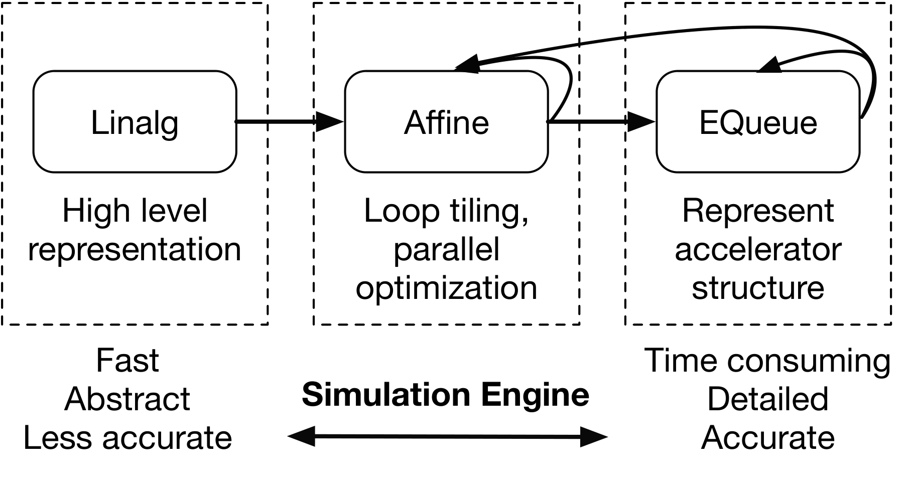
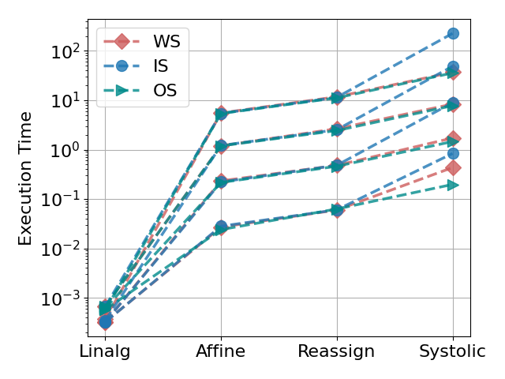
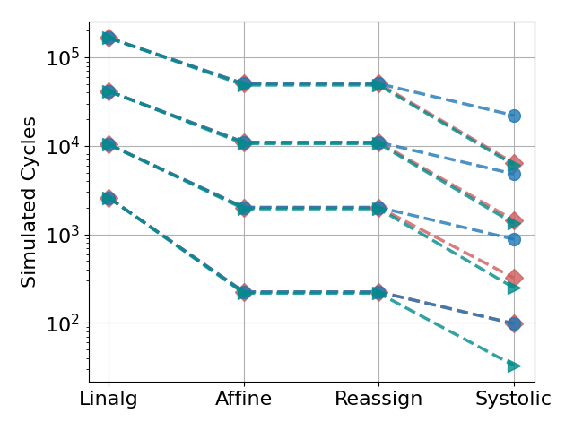

# Compilation flow

The benefit of a compiler-driven approach is it makes it possible to program the simulator using compiler passes. Integrating with a compiler stack’s shared passes avoids the need for tedious, manual modification to explore different program mappings.

In this tutorial, we show how to express the same systolic array but with compilation passes.

### Rationale

MLIR by nature has the capability to represent multi-level abstraction with its dialects: one can express with more and more detail information along the *Linalg-Affine-EQueue* dialect lines, where the high-level Linalg dialect can represent tensor operations, the Affine dialect can express explicit loop tiling, and finally the EQueue dialect can model explicit data movement among hardware components.



Such a lowering pipeline enables simulation at multiple levels of detail: users can get quick-and-dirty performance estimates
at the Linalg level on tensor behavior, or they can lower gradually to more detailed EQueue hardware simulations for more accurate but costly estimation.

### Overview

IS, WS, and OS all share a core systolic design: on each cycle, each PE reads a value, modify it, and writes to a neighbor PE. Figure 10 shows how the systolic dataflows share stages along a lowering pipeline. The first 3 stages (Linalg, Affine, and Reassign) are the same. The final stage (Systolic) diverges, but lowering from Reassign stage allows different dataflows to share lowering passes with different orders and parameters. This way, hardware designers can only implement the highest level abstraction and then
explore design spaces with no programming overhead.


### Linalg Implementation (Also see )

Again we start with a **structural modeling** stage. This time, we show another way to implement PE array - via a vector duplication operation. 

```c#
mem = create_mem({ 4 }, 32, "RegisterFile", 3)
pe = create_comp({"mem", "proc"}, {mem, proc})
dma = create_dma()
pe = create_comp(ArrayRef<std::string>{"proc", "mem", "dma"}）
pe_array = std_splat(pe, {14,12})//PE shape = 14x12
```

After some lowering passes, it will eventually looks like the same thing as below (see the generator tutorial). But it shows how we can save efforts with lowering passes.

```c#
pe_array = create_comp()
for aw in arr_width
    for ah in arr_height
        proc = create_proc("AIEngine")
        mem = create_mem({ 4 }, 32, "RegisterFile", 3)
        pe = create_comp({"mem", "proc"}, {mem, proc})
        add_comp(pe_array, {"pe"+str(aw)+"_"+str(wh)}, {pe})
```

Next step is to implement the **control flow**. 

For linalg dialect, the control flow is simply a few lines (pseudo code). 

```c#
done = equeue.launch(...) in (start, accel){
    linalg.generic {args_in = 2, args_out = 1, 
                    indexing_maps = [#map1, #map2, #map3], 
                    iterator_types = ["parallel", "parallel", "parallel", "parallel", "parallel", "parallel", "parallel"]} 
    				ifmap, weight, ofmap {		
       ofmap += weight*ofmap
       %14 = std.addf(arg3, %arg1, %arg2) {op_name = "mac"} : (f32, f32, f32) -> f32
       linalg.yield ofmap
    }
    ...
}
```

>#map1, #map2, #map3 corresponding to the affine indexing of ifmap, weight and ofmap of the 7 nested loop on a convolution: B, N, Eh, Ew, Fh, Fw,C
>
>For example, #map1 = affine_map<(d0, d1, d2, d3, d4, d5, d6) -> (d0, d2, d3, d6)> taking in (B, Eh, Ew, C) is a mapping of loop iterator to the ifmap

### Lowering Pipeline - How to Run

The details of passes are explained in the [Passes](../../../mydoc/Passes.md) document. Here we only explain the ones we used in lowering pipeline.

#### Generate Linalg Implementation

The implementation starts with MLIR program generation. But this time we are generating high level Linalg dialects

```c#
bin/equeue-opt -generate=linalg -config=[config-file] > [linalg].mlir
```


#### Linalg to Affine

We start with a convolution in Linalg dialect, an MLIR dialect that can express arbitrary linear algebra. The Linalg dialect can be first lowered to the Affine dialect with the standard `--convert-linalg-to-affine-loops`, which lowers the convolution to explicit nested loops. We then apply `--equeue-read-write` to change load and store operations in Affine dialect to read and write in EQueue dialect to model data movement.

```shell
bin/equeue-opt [linalg].mlir -convert-linalg-to-affine-loops -equeue-read-write > [affine].mlir
```

#### Loop Tiling and Simplification

Next step is to reorder the loops in order to perform the loop tiling under array configuration *arr_height, arr_width.* For example, for WS, we would like to switch *Eh* and *Ew* loop into inner loops to perform tiling on outer loops, indicatingweights are stationary on the PE  *Eh \* Eh* cycles.

Also, for my personal preference I would perform some loop simplification passes, e.g. remove loop with sizes of `1`, merging some outer loops. This step is not necessary. But it's helpful to make code readable. 

Below are the passes I would use (with simplification) for the three dataflows:

- For WS, each weight is stationary on a PE until computed with *Eh \* Ew* ifmaps; 

```shell
bin/equeue-opt [affine].mlir \
			   --loop-reorder="orders=0,1,4,5,6,2,3" \ 
			   --merge-loop="indices=2,3,4" \
			   --merge-loop="indices=0,1" \
			   --loop-remove -cse \
			   --loop-tile="tile-sizes=[arr_height],[arr_width]" \
			   --simplify-affine-loop -simplify-affine-structures \
			   --affine-loop-unroll="unroll-factor=1" \
			   > [reorder].mlir
```

- For IS, each ifmap is stationary for *N* weights; 

```shell
bin/equeue-opt [affine].mlir \
			   --loop-reorder="orders=0,2,3,4,5,6,1" \ 
			   --merge-loop="indices=1,2,3" \
			   --merge-loop="indices=4,5" \
			   --loop-remove -cse \
			   --loop-tile="tile-sizes=[arr_height],[arr_width]" \
  			   --simplify-affine-loop -simplify-affine-structures \
			   --affine-loop-unroll="unroll-factor=1" \
	           	   > [reorder].mlir
```

- For OS, each ofmap is stationary until accumulated with _Fh * Fw * C_ ifmaps and weights.

```shell
bin/equeue-opt [affine].mlir \
			   --merge-loop="indices=3,4" \
			   --merge-loop="indices=0,1,2" \
			   --loop-remove -cse \
		           --loop-tile="tile-sizes=[arr_height],[arr_width]" \
			   --simplify-affine-loop -simplify-affine-structures \
			   --affine-loop-unroll="unroll-factor=1" \
			   > [reorder].mlir
```

#### Affine to Buffer Reassign

So far we only have a black box accelerator. Next step is to utilize individual PE. 

Here we apply the `--allocate-buffer` and `--reassign-buffer` passes to replace direct SRAM reads and writes with PE local register accesses. 

```shell
bin/equeue-opt [reorder].mlir \
				--allocate-mem="structs-names=pe_array@mem,pe_array@mem,pe_array@mem \
				indices=0,0,0 mem-names=pe_ibuffer,pe_wbuffer,pe_obuffer sizes=1,1,1" \
				> [allocate].mlir
bin/equeue-opt [allocate].mlir \
				--reassign-buffer="old-buffer=ibuffer,wbuffer,obuffer \
				new-buffer=pe_array@pe_ibuffer,pe_array@pe_wbuffer,pe_array@pe_obuffer \
          			indices=11,11,11" \
			        > [reassign].mlir
```

#### Buffer Reassign to Systolic Array

After buffer reassignment, we can now implement the systolic communication. 

For WS and IS, we first copy weights or ifmaps from the SRAM into the PE array registers. For OS, this step is omitted.

Then we implement the systolic communication with a `--mem-copy` pass to pass from one pe to its neighbor e.g. `pe_array` to `pe_array[+1][:]` perform memcpy from each PE to its neighbor of next-row. We will

We also merge the memcpy with existing launch operations using `--merge-memcpy-launch` , since memcpy is syntactic sugar for launch operation with sequential read and write.

- For WS, we need to pass the ifmaps and ofmaps to the right and down on every cycle.

```shell
# Copy weights from the SRAM into the PE array registers
# The weights will remain stationary for during systolic communication
bin/equeue-opt [reassign].mlir \
				--add-loop="indices=8 loops=[arr_width]" \
				--add-loop="indices=9 loops=[arr_height]" \
				--mem-copy="src=pe_array@pe_wbuffer dest=pe_array[+1][:]@pe_wbuffer \
				dma=pe_array@dma indices=10 insertions=0" \
				--simplify-affine-structures \
			        > [stationary-weight].mlir
# Implement the systolic communication for ifmap 
bin/equeue-opt [stationary-weight].mlir \
				--match-equeue-structure="indices=13 structs-names=pe_array@proc" 
				--mem-copy="src=pe_array@pe_ibuffer dest=pe_array[:][+1]@pe_ibuffer \
				dma=pe_array@proc indices=13 insertions=0" \
				--merge-memcpy-launch="launch=0 memcpy=1" \
			        > [systolic-ifmap].mlir
# Implement the systolic communication for ofmap 
bin/equeue-opt [systolic-ifmap].mlir \
				--split-launch="indices=0 at=13" \
				--reassign-buffer="old-buffer=pe_array@pe_obuffer \
            	new-buffer=pe_array[+1][:]@pe_obuffer indices=13" \
            	--cse \
			    > [systolic-ofmap].mlir
```

- For IS, _N_ weights and ofmaps are passed.

```shell
# Copy ifmaps from the SRAM into the PE array registers
# The ifmap will remain stationary for during systolic communication
bin/equeue-opt [reassign].mlir \
                --add-loop="indices=8 loops=[arr_height]" \
                --add-loop="indices=9 loops=[arr_width]" \
                --mem-copy="src=pe_array@pe_ibuffer dest=pe_array[+1][:]@pe_ibuffer \
                dma=pe_array@dma indices=10 insertions=0" \
                --simplify-affine-structures \
                > [stationary-ifmap].mlir
# Implement the systolic communication for ifmap 
bin/equeue-opt [stationary-ifmap].mlir \
                --match-equeue-structure="indices=13 structs-names=pe_array@proc" 
                --mem-copy="src=pe_array@pe_wbuffer dest=pe_array[:][+1]@pe_wbuffer \
                dma=pe_array@proc indices=13 insertions=0" \
                --merge-memcpy-launch="launch=0 memcpy=1" \
                > [weight-ifmap].mlir
# Implement the systolic communication for ofmap 
bin/equeue-opt [systolic-ifmap].mlir \
		--split-launch="indices=0 at=12" \
		--reassign-buffer="old-buffer=pe_array@pe_obuffer \
            	new-buffer=pe_array[+1][:]@pe_obuffer indices=13" \
            	--cse \
			    > [systolic-ofmap].mlir
```

- For OS, _Fh * Fw * C_ ifmaps and weights are passed.

```shell
# Implement the systolic communication for weight 
bin/equeue-opt [reorder].mlir \
                --match-equeue-structure="indices=11 structs-names=pe_array@proc" 
                --mem-copy="src=pe_array@pe_wbuffer dest=pe_array[+1][:]@pe_wbuffer \
                dma=pe_array@proc indices=11 insertions=0" \
                --merge-memcpy-launch="launch=0 memcpy=0" \
                > [systolic-weight].mlir
# Implement the systolic communication for ifmap 
bin/equeue-opt [systolic-weight].mlir \
                --mem-copy="src=pe_array@pe_ibuffer dest=pe_array[:][+1]@pe_ibuffer \
                dma=pe_array@proc indices=11 insertions=0" \
                --merge-memcpy-launch="launch=0 memcpy=0" \
                > [systolic-ifmap].mlir
```

#### Lower Vectorization

Finally, we apply `--parallel-to-equeue` and `--lower-extraction` passes to create individual PE from a vector of PE and fully unroll the loops. Actually, this operation can be even simpler if we model batch parallelization in simulator. This can be a TODO list. 

Assuming the output of last stage is `[ofmap].mlir`, we will run the following statement

```shell
bin/equeue-opt --parallel-to-equeue -affine-loop-unroll="unroll-full" 
			   --affine-loop-unroll="unroll-full" \
			   --lower-extraction \
			   --simplify-affine-structures \
			   --lower-extraction \
			   --lower-affine -cse \
			   > [unroll].mlir
```

#### Simulation

Finally, the simulation is nothing different from previous tutorial

```
./bin/equeue-opt [unroll].mlir -simulate -show-col-name -json=[json_filename].json 
```


### Compare to Generator

Below we plot the simulator execution time, simulated runtime, and read and write bandwidth on the four convolution settings at the four stages (Linalg, Affine, Reassign, and Systolic). This compiler pipeline does not take a significant amount of time (it typically finishes in microseconds). 

| Execution time                                               | Runtime in Cycle                                             |
| ------------------------------------------------------------ | ------------------------------------------------------------ |
|  |    |
| Read Bandwidth                                               | Write Bandwidth                                              |
|  |  |

The first three lowering stages are identical for different dataflows, so they have the same bandwidth and runtime. This sharing reflects the framework’s reusability for common parts of different accelerator implementations. At the final stage, the runtime differs from the simpler generator-based approach from generator implementation by 1.2% on average, up to 2%. The difference lies in warm-up and cool-down phases that the passes do not model. Register and SRAM bandwidth differs for the same reason.


### Conclusion

The lowering pass is not perfect at this moment. However, everyone can contribute to this open-source framework by creating more passes, just like we do for MLIR. 

The nice thing of this example is that we show the possibility to just lower from pure software (a convolution) and perform somehow sophisticated mapping algorithm onto it (systolic passing).

The availability of reusable lowering passes lets designers rapidly switch between program–accelerator mappings and enables efficient design space exploration.
