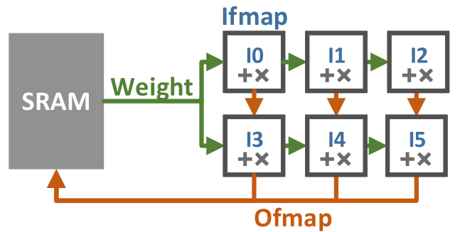
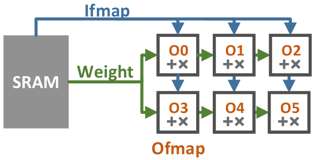

# Systolic Array
In this tutorial, we will introduce how to simulate an input convolution on a systolic array on three different dataflows using 

1) [Generator](01-Generator/) implementation direct on EQueue level,

2) [Compilation](02-Compilation/) from high level dialects.

You can directly jump to the implementation details if you already familiar with the concept.

### Dataflows

The key design decision in a systolic accelerator implementation is the dataflow, which determines how loops in the algorithm are mapped spatially onto **processing elements (PEs)**. 

Here we consider three widely-used dataflows: Weight Stationary (WS), Input Stationary (IS), and Output Stationary (OS). The difference is which tensor remains in each PE’s register file: the weights, input feature map (ifmap), or output feature map (ofmap). 

The idea of simulating convolution originally comes from the paper ["SCALE-Sim: Systolic CNN Accelerator Simulator"](https://arxiv.org/abs/1811.02883) . We reimplement it to illustrate the flexibility of EQueue dialect. One can find detail explanation in their [paper](https://arxiv.org/abs/1811.02883) and [github repo](https://github.com/ARM-software/SCALE-Sim). Here we only introduce them with a brief idea.

Below is the illustration for the data movement of each dataflow on a systolic array. On each cycle, each PE computes a part of final result and passes the partial result to its neighbor.

| Weight Stationary                                            | Input Stationary                                             | Output Stationary                                            |
| ------------------------------------------------------------ | ------------------------------------------------------------ | ------------------------------------------------------------ |
|  |  |  |

Assuming we convolve *N* weights of size *Fh\*Fw* with an ofmap of size *Ew\*Eh* with *C* channels, so that a convolution can be represented as 
```
for n in N
  for eh in Eh, ew in Ew
    for c in C
      for fh in Fh, fw in Fw
        ofmap[n, eh, ew] += ifmap[ew+fw-1, eh+fh-1,c ] x weight[n, fw, fh, c]
```

- For WS, on each cycle, ifmaps and ofmaps are passed to the neighbor PEs, while each weight is stationary
  until  *Ew\*Eh* ifmaps convolve with it;
- For IS, at each cycle, weights and ofmaps are passed to the neighbor PEs, while every ifmap is stationary
  until *N* weights convolve with it;
- For OS, at each cycle, ifmaps and weights are passed to the neighbor PEs, while every ofmap is stationary
  until *Fh \* Fw \* C* ifmaps and are convolved.


Now after the basic ideas, we will go into details on how these systolic array can be implemented in EQueue framework. Check on 1) [Generator](Generator/) implementation and 2) [Compilation](Compilation/) from high level dialects.


